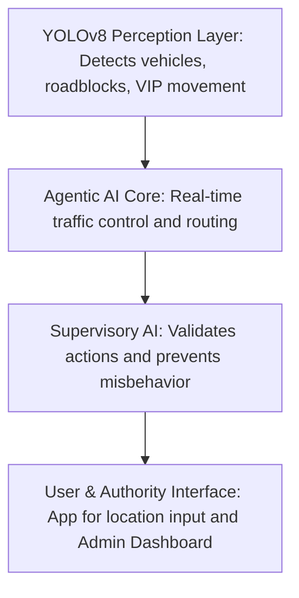
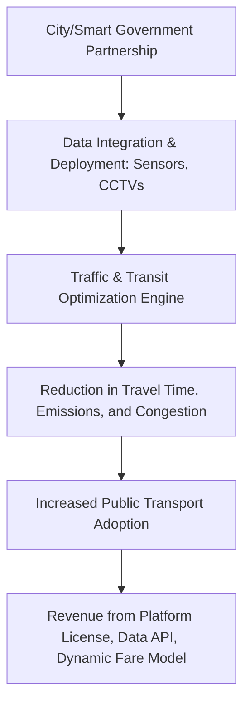

# 🚦 Real-Time Public Transport Optimization System

> A multi-layered AI-powered solution to optimize public transport using real-time traffic perception, dynamic routing, and agentic decision-making.

---

## 🔍 Overview

Traditional public transportation relies on static schedules and routes, resulting in:
- Long wait times
- Overcrowding
- Inefficiency
- Poor commuter experience

Our system introduces a 4-Layer AI Stack to create a **Smart, Real-Time Adaptive Transit Ecosystem**.

---

## 🧠 System Architecture

- **YOLOv8 Perception**: Computer vision layer that detects traffic objects and anomalies.
- **Agentic AI**: Makes autonomous traffic decisions (signals, buses, taxis).
- **Supervisory AI**: Monitors Agentic AI and avoids misbehavior.
- **Interface Layer**: Web app for authorities + Android app for users.

---

## 💼 Business Model

### 💡 Revenue Streams:
- City-level **Platform Licensing** (Subscription-Based SaaS)
- **Data APIs** for real-time traffic statistics to urban planners
- **Commission on AI-based Dynamic Fare System**

---

## 🔑 Key Features

- 🚌 Demand-based Bus & Taxi Routing using App Check-ins
- 🚦 Real-Time Signal Control using Reinforcement + Fuzzy Logic
- 🧾 AI-Based Fare Estimation (Auto-Rickshaw, Taxi)
- 🛑 Accident Detection + Emergency Lane Clearance
- 👮 E-Challan Generation via Number Plate OCR
- 📡 Admin Dashboard + Live Heatmaps + Congestion Zones

---

## 🌐 Live Preview

🔐 **Auth Required (Testing Phase)**  
- **URL**: [https://marg-vedha.vercel.app/dashboard](https://marg-vedha.vercel.app/dashboard)  
- **Email**: margvedha01@gmail.com  
- **Password**: DR@123

> Frontend Prototype is currently deployed for demonstration. Full backend with AI integration is under development.

---

## 📩 Contact

For collaborations or technical queries, please contact:  
📧 margvedha01@gmail.com

---

## 📜 License

MIT License — Open for research, collaboration, and smart city innovation.
